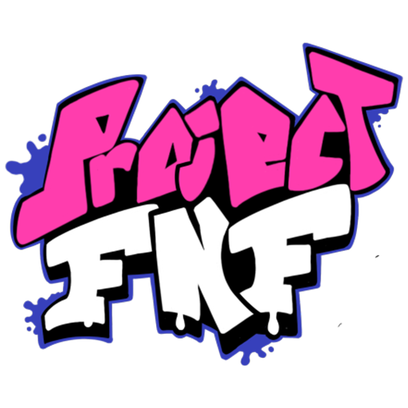

# ProjectFNF

**Quality of Life Psych Engine Fork**

"*I Live My Life a Quarter Mile at a Time*" - EastDeveloper

**WARNING**: This engine is still very early in development! You can request new features by opening a issue!

*Thanks to l1ttleO for [the base code](https://github.com/l1ttleO/ProjectFNF)!*

## Installation:

Follow a Friday Night Funkin' source code compilation tutorial, after this you will need to install LuaJIT.

You can do this with: `haxelib install linc_luajit` on a Command prompt/PowerShell

...Or if you don't want your mod to be able to run .lua scripts, delete the "LUA_ALLOWED" line on Project.xml

## Credits

-   aflacc - Original Creator, Developer
-   EastDeveloper - Revival Founder, Developer
-   Stilic - Revival Co-Founder, Developer

## Psych Engine Credits

-   Shadow Mario - Coding
-   RiverOaken - Arts and Animations

### Special Thanks

-   Keoiki - Note Splash Animations
